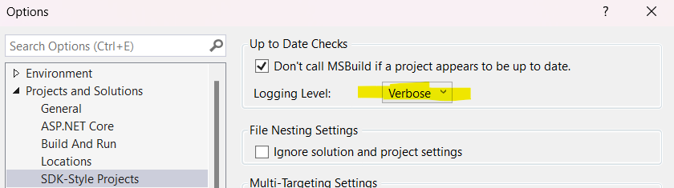

# MauiBuildAcceleration

Repo for testing: https://github.com/xamarin/xamarin-android/issues/8581

Other links:

* https://github.com/dotnet/project-system/blob/main/docs/build-acceleration.md
* https://github.com/dotnet/project-system/blob/main/docs/up-to-date-check.md

## How to Reproduce issue with Build Acceleration

Enable this setting (in VS 17.8 or higher):



1. Do an initial build + deploy.

2. Make a XAML change in `MainPage.xaml`.

3. Do an incremental build + deploy.

The log says:

```
1>FastUpToDate: Ignoring up-to-date check items with Kind="ImplicitBuild" (MauilClassLibrary)
1>FastUpToDate: Checking configuration Debug|AnyCPU|net8.0-android: (MauilClassLibrary)
1>FastUpToDate:     Build acceleration is enabled for this project via a feature flag. See "Tools | Options | Environment | Preview Features" to control this setting. See https://aka.ms/vs-build-acceleration. (MauilClassLibrary)
1>FastUpToDate:     Comparing timestamps of inputs and outputs: (MauilClassLibrary)
1>FastUpToDate:         Adding UpToDateCheckBuilt outputs: (MauilClassLibrary)
1>FastUpToDate:             D:\src\MauiBuildAcceleration\MauilClassLibrary\bin\Debug\net8.0-android\MauilClassLibrary.dll (MauilClassLibrary)
1>FastUpToDate:             D:\src\MauiBuildAcceleration\MauilClassLibrary\obj\Debug\net8.0-android\MauilClassLibrary.dll (MauilClassLibrary)
1>FastUpToDate:             D:\src\MauiBuildAcceleration\MauilClassLibrary\obj\Debug\net8.0-android\MauilClassLibrary.pdb (MauilClassLibrary)
1>FastUpToDate:             D:\src\MauiBuildAcceleration\MauilClassLibrary\bin\Debug\net8.0-android\MauilClassLibrary.pdb (MauilClassLibrary)
1>FastUpToDate:         Adding newest import input: (MauilClassLibrary)
1>FastUpToDate:             D:\src\MauiBuildAcceleration\MauilClassLibrary\MauilClassLibrary.csproj (MauilClassLibrary)
1>FastUpToDate:         Adding AndroidResource inputs: (MauilClassLibrary)
1>FastUpToDate:             D:\src\MauiBuildAcceleration\MauilClassLibrary\Platforms\Android\Resources\values\strings.xml (MauilClassLibrary)
1>FastUpToDate:         Adding Compile inputs: (MauilClassLibrary)
1>FastUpToDate:             D:\src\MauiBuildAcceleration\MauilClassLibrary\Platforms\Windows\PlatformClass1.cs (MauilClassLibrary)
1>FastUpToDate:             D:\src\MauiBuildAcceleration\MauilClassLibrary\Class1.cs (MauilClassLibrary)
1>FastUpToDate:             D:\src\MauiBuildAcceleration\MauilClassLibrary\Platforms\MacCatalyst\PlatformClass1.cs (MauilClassLibrary)
1>FastUpToDate:             D:\src\MauiBuildAcceleration\MauilClassLibrary\Platforms\iOS\PlatformClass1.cs (MauilClassLibrary)
1>FastUpToDate:             D:\src\MauiBuildAcceleration\MauilClassLibrary\Platforms\Tizen\PlatformClass1.cs (MauilClassLibrary)
1>FastUpToDate:             D:\src\MauiBuildAcceleration\MauilClassLibrary\Platforms\Android\PlatformClass1.cs (MauilClassLibrary)
1>FastUpToDate:         Adding ResolvedCompilationReference inputs: (MauilClassLibrary)
1>FastUpToDate:             D:\src\MauiBuildAcceleration\MauilClassLibrary\obj\Debug\net8.0-android\_Microsoft.Android.Resource.Designer.dll (MauilClassLibrary)
1>FastUpToDate: Input ResolvedCompilationReference item 'D:\src\MauiBuildAcceleration\MauilClassLibrary\obj\Debug\net8.0-android\_Microsoft.Android.Resource.Designer.dll' (2024-01-04 09:13:06.818) has been modified since the last successful build started (2024-01-04 09:13:05.405), not up-to-date. (MauilClassLibrary)
1>FastUpToDate: Up-to-date check completed in 0.4 ms (MauilClassLibrary)
```
